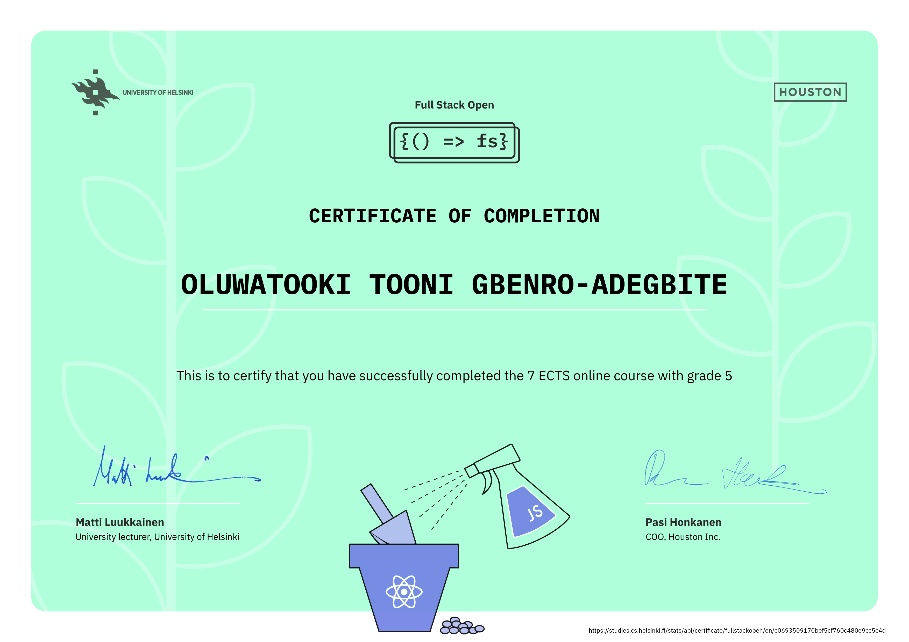

# Full Stack Open

My solutions for the exercises of the University of Helsinki's **Full Stack Open** course.  
This repository contains solutions from **part 0 to part 9** of the course.

Full Stack Open is an excellent introduction to modern web development.  
The **core course** consists of parts 0 to 5. After the core course, you can complete other parts in the order you want.

---

## 📚 Course Content

### Part 0: Fundamentals of Web Apps
The basics of web development and advances in web application development during the last few decades.  
Topics include:
- Web application structure
- HTTP protocol
- Developer tools
- Traditional web applications
- AJAX
- Single-page apps
- JavaScript libraries

### Part 1: Introduction to React
- Familiarizing with the React library
- JavaScript features important for understanding React

### Part 2: Communicating with Server
- Continuation of React basics
- Rendering data
- Submitting data with HTML forms
- Fetching data from a backend server
- Simple CSS styling

### Part 3: Programming a Server with Node.js and Express
- Implementing and deploying a simple REST API
- Using Node.js and Express
- Storing application data in a MongoDB database

### Part 4: Testing Express Servers, User Administration
- Writing unit and integration tests
- Implementing user authentication and authorization

### Part 5: Testing React Apps
- Testing React code
- Token-based authentication

### Part 6: Advanced State Management
- Introduction to Redux for managing React app state
- Centralized state management, predictability, and debugging

### Part 7: React Router, Custom Hooks, Styling, Webpack
- Dividing applications into views with React Router
- Building custom hooks
- Styling React apps in different ways
- Introduction to Webpack  

---

## Course Certificates
### Full Stack Open: core course

